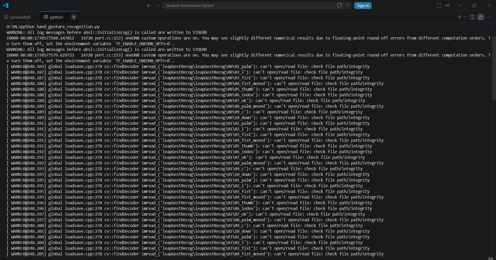
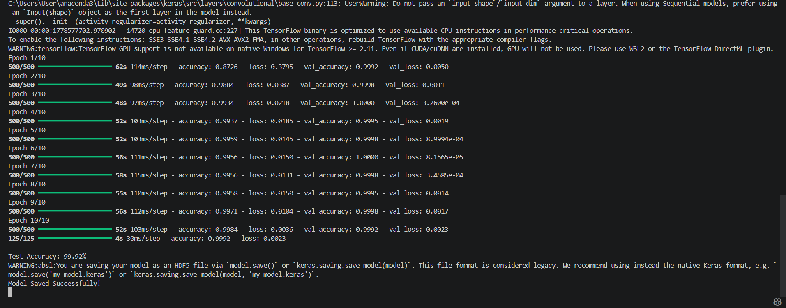
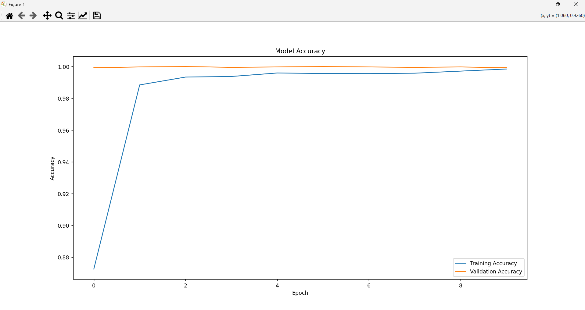

# PRODIGY_ML_04

# Hand Gesture Recognition using CNN

This project is developed as part of the Machine Learning Internship at ProDigy InfoTech.

## Objective

Develop a hand gesture recognition model that can accurately identify and classify different hand gestures from image data using Deep Learning techniques.

---

## Technologies Used

- Python
- TensorFlow
- Keras
- OpenCV
- NumPy
- Matplotlib
- Scikit-learn

---

## Dataset

LeapGestRecog Dataset:

https://www.kaggle.com/datasets/gti-upm/leapgestrecog

---

## Features

- Image preprocessing
- Hand gesture classification
- CNN model training
- Accuracy evaluation
- Model saving
- Accuracy visualization graph

---

## Project Structure

```bash
PRODIGY_ML_04/
│
├── hand_gesture_recognition.py
├── hand_gesture_model.h5
├── README.md
├── outputs/
│   ├── output1.png
│   ├── output2.png
│   └── output3.png
```

---

## Output Screenshots

### Dataset Loading


### Model Training Result


### Accuracy Graph


---

## Result

The CNN model successfully classified multiple hand gestures with very high accuracy.

Test Accuracy Achieved: **99.92%**

---

## Author

Pratiksha C Uchil

---

## Internship

ProDigy InfoTech - Machine Learning Internship
